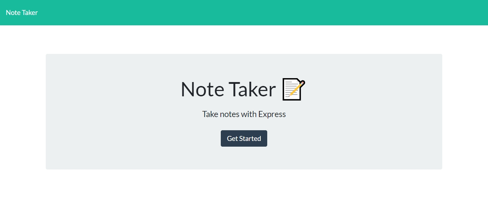

# Note-Taker

# Introduction to the project
* Note Taker was born from the need to help people remember those important tasks that must be carried out. Note taker it is a very easy way to take all your important tasks. Can be tasks to be done throughout a day, a week or even a month.
# About this project 
* This app allows any user to take notes about pending tasks and save it into a database wich is a file called db.json. The user will be able to see all the taken notes. Once the task is done, the user can delete that note with a simple click, and it will delete that note from the database too.
Every time the user create a Note, this will have a unique ID and the Note will be added inside and array of objects inside db.json.

# Technologies used

# Challenges
* The biggest challenge for me was creating the DELETE method in order to delete just one single note. With the help of the unique ID, I use a forEach loop to get the index for the specfic element that matches the ID. 
I learned a lot using routes, and to be careful with them, because I couldn't deploy the application to heroku, and I got errors like H13 and H10, and it was only for one of my routes, so I learned that sometimes you have to double and triple check your routes!

# User Story 
AS A small business owner
I WANT to be able to write and save notes
SO THAT I can organize my thoughts and keep track of tasks I need to complete
# Acceptance Criteria

GIVEN a note-taking application

WHEN I open the Note Taker
THEN I am presented with a landing page with a link to a notes page

WHEN I click on the link to the notes page
THEN I am presented with a page with existing notes listed in the left-hand column, plus empty fields to enter a new note title and the note’s text in the right-hand column

WHEN I enter a new note title and the note’s text
THEN a Save icon appears in the navigation at the top of the page

WHEN I click on the Save icon
THEN the new note I have entered is saved and appears in the left-hand column with the other existing notes

WHEN I click on an existing note in the list in the left-hand column
THEN that note appears in the right-hand column

WHEN I click on the Write icon in the navigation at the top of the page
THEN I am presented with empty fields to enter a new note title and the note’s text in the right-hand column

# Example of the deployed web
# Home Page

# Notes Page

# Create and save a new note

# View the created note

# Delete your note

# Link to deployed app!
* Check the app for yourself! 

<a href="https://blooming-anchorage-79721.herokuapp.com/" target="_blank">Click here TO GO TO LIVE WEB!</a>

# THANKS FOR VISITING MY PROJECT!